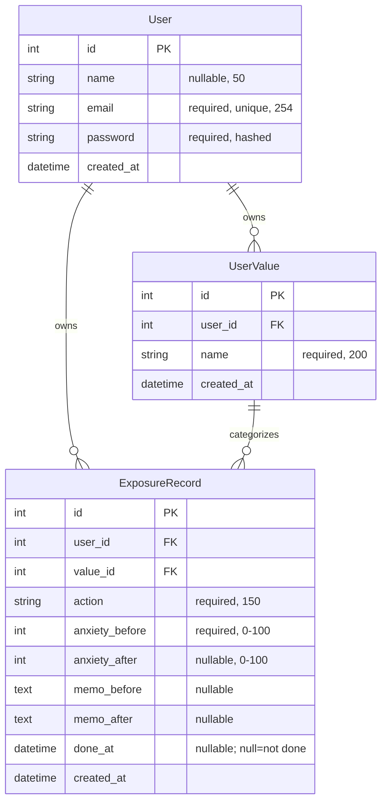

# ippo データモデル / ER 図（MVP・凍結）

最終更新: 2026-06-24

---

## エンティティ定義

### User（ログインする人）
| フィールド | 型 | 制約 | 用途 |
|---|---|---|---|
| id | integer | 主キー・自動採番 | 一意識別 |
| name | string(50) | 任意 | 表示名 |
| email | string(254) | 必須・ユニーク | ログイン ID（`EmailField` 既定の最大長 254） |
| password | string(固定長) | 必須 | 認証用。**ハッシュで保存** |
| created_at | datetime | 自動 | 登録日時 |

### UserValue（ユーザーが明確化した価値）
| フィールド | 型 | 制約 | 用途 |
|---|---|---|---|
| id | integer | 主キー・自動採番 | 一意識別 |
| user | FK → User | 必須 | 誰の価値か |
| name | string(200) | 必須 | 価値の内容（例：人と誠実に関わる） |
| created_at | datetime | 自動 | 登録日時 |

関係：UserValue は User に属する（1 : 多）。

### ExposureRecord（曝露の記録）
| フィールド | 型 | 制約 | 用途 |
|---|---|---|---|
| id | integer | 主キー・自動採番 | 一意識別 |
| user | FK → User | 必須 | 誰の記録か（**データ分離の土台**） |
| value | FK → UserValue | 必須 | どの価値に紐づくか |
| action | string(150) | 必須 | 行動内容 |
| anxiety_before | integer | 必須・0–100 | 実施前の不安 |
| anxiety_after | integer | 任意（null 可）・0–100 | 実施後の不安 |
| memo_before | text | 任意 | 計画時メモ |
| memo_after | text | 任意 | 実施後メモ |
| done_at | datetime | 任意（null 可） | **実施日時。null＝未実施** |
| created_at | datetime | 自動 | 記録日時 |

関係：ExposureRecord は User に属し、UserValue を 1 つ参照する。

## 設計ルール
- **実施判定は `done_at` 一本**（null＝未実施）。`done_at` が入って初めて `anxiety_after`・`memo_after` が意味を持つ。
- `anxiety_before` / `anxiety_after` の **0–100 範囲は入力バリデーションで担保**する。`ExposureRecordSerializer` で `min_value=0` / `max_value=100` を指定して実装済み。
- `ExposureRecord.value` は、その記録の所有者と同じ User の UserValue を指す（他人の価値には紐づけない。入力時に検証）。

## インデックス設計（物理設計の補足）
- 外部キー `user` には既定でインデックスが付く（Django の ForeignKey は `db_index=True` が既定）。一覧取得で「本人のデータだけ」を高速に絞れる。
- カレンダー（`GET /api/exposures?from=&to=`）は「本人 × `done_at` の範囲」で検索するため、`(user, done_at)` の複合インデックスを張ると効率的。
- `ExposureRecord.Meta.indexes` に `['user', 'done_at']` の複合インデックスを追加済み。

## ER 図

### ER 図の読み方
- 記号 `||--o{` は **1 対多**：`||`＝ちょうど 1、`o{`＝0 個以上。例「1 人の User は 0 個以上の ExposureRecord を持つ」。
- コロンの後ろ（`owns` / `categorizes`）は**関係を説明する人間向けラベル**で、`A ＜ラベル＞ B` と読む（例「User owns ExposureRecord」）。スキーマ自体には影響しない。
- `PK`＝主キー、`FK`＝外部キー。
- この `mermaid` ブロックは GitHub や多くの Markdown プレビューで自動的に図として描画される。
